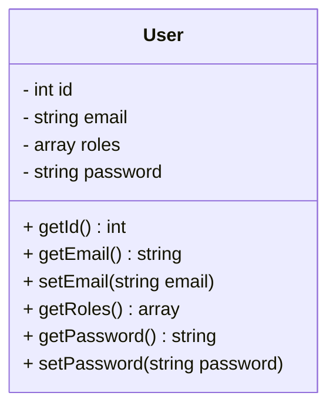
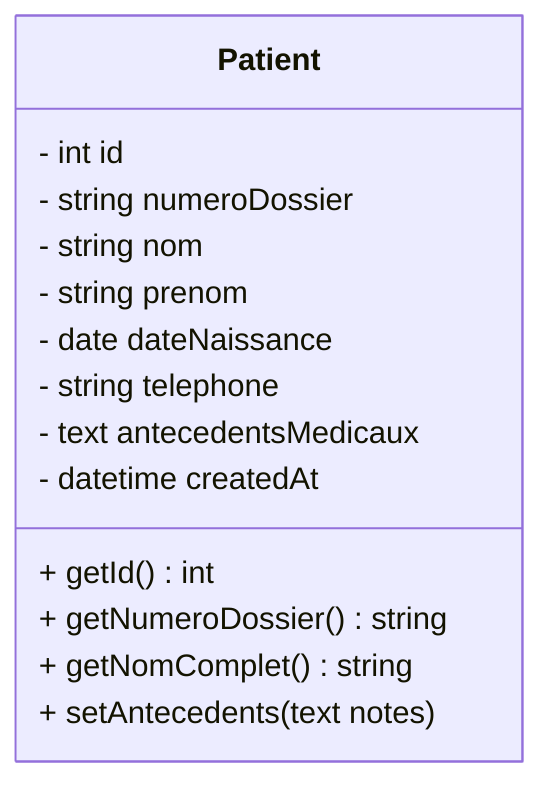

# Architecture et Conception du Projet Microservices

Ce document présente l'architecture globale du projet ainsi que la conception (Cas d'utilisation et Diagrammes de classes) pour les deux microservices principaux.

---

## 1. Explication de l'Architecture (Pour votre encadrant)

Le projet repose sur une **Architecture Orientée Microservices (Microservices Architecture)** organisée au sein d'un **Monorepo**. Cette approche permet de diviser l'application en petits services indépendants, facilitant ainsi la maintenance, la scalabilité et le travail en équipe.

### Les Composants de l'Architecture :

1. **Le Frontend (React.js avec Vite)** :
   C'est l'interface utilisateur (SPA - Single Page Application). Elle communique exclusivement avec les services backend via des appels API REST.

2. **L'API Gateway / Reverse Proxy (Nginx)** :
   Nginx agit comme un point d'entrée unique pour le frontend. Il intercepte les requêtes de l'utilisateur et les redirige (routage) vers le bon microservice en fonction de l'URL (ex: `/api/auth` vers le service d'authentification, `/api/patients` vers le service de gestion des patients).

3. **Microservice d'Authentification (Symfony / PHP)** :
   Ce service est totalement isolé. Son seul rôle est de gérer l'identité des utilisateurs (inscription, connexion) et de délivrer des **Tokens JWT (JSON Web Tokens)**. Ce token sera ensuite utilisé pour prouver l'identité de l'utilisateur aux autres microservices. Il possède sa propre base de données.

4. **Microservice de Gestion des Dossiers Patients (Symfony / PHP)** :
   *(Note : Actuellement nommé `service-students` dans nos dossiers, nous le renommerons ou l'adapterons pour les patients)*.
   Ce service gère exclusivement la logique métier liée aux patients (Création, Lecture, Mise à jour, Suppression - CRUD). Il vérifie la validité du Token JWT fourni par l'utilisateur avant d'autoriser l'accès aux données médicales. Il possède également sa propre base de données isolée.

**Avantage principal pour le projet :** Le couplage faible. Si le service des patients tombe en panne, le service d'authentification continue de fonctionner. Chaque service peut évoluer indépendamment et avoir sa propre technologie de base de données.

---

## 2. Diagrammes des Cas d'Utilisation (Use Cases)

Voici les interactions possibles entre les acteurs (Médecin, Secrétaire, Administrateur) et les microservices.

### A. Microservice Authentification

```mermaid
usecaseDiagram
    actor Utilisateur as "Personnel (Médecin/Admin)"
    
    package "Microservice Authentification" {
        usecase UC1 as "Se connecter (Login)"
        usecase UC2 as "S'inscrire (Register)"
        usecase UC3 as "Renouveler le Token"
    }
    
    Utilisateur --> UC1
    Utilisateur --> UC2
    Utilisateur --> UC3
```

### B. Microservice Gestion Dossier Patient

```mermaid
usecaseDiagram
    actor Personnel as "Personnel Médical"
    
    package "Microservice Patients" {
        usecase UC4 as "Créer un dossier patient"
        usecase UC5 as "Consulter un dossier"
        usecase UC6 as "Rechercher des patients"
        usecase UC7 as "Mettre à jour l'historique médical"
        usecase UC8 as "Archiver un dossier"
    }
    
    Personnel --> UC4
    Personnel --> UC5
    Personnel --> UC6
    Personnel --> UC7
    Personnel --> UC8
```

---

## 3. Diagrammes de Classes

Chaque microservice gère ses propres entités (tables en base de données) de manière indépendante.

### A. Microservice Authentification

Dans ce service, nous ne stockons que les informations de sécurité.



### B. Microservice Gestion Dossier Patient

Dans ce service, nous gérons les données médicales et administratives du patient.


